# 🏗️ Tool Dispatcher Architecture


---

## 📋 Overview

The Tool & MCP Dispatcher module provides a unified interface for the agent to discover and invoke both built-in tools and MCP server tools through a centralized dispatch architecture.

## 📊 Architecture Diagrams

```mermaid
flowchart LR
    subgraph User["👤 User"]
        CLI["CLI/API<br/>Entry Point"]
    end

    subgraph Core["🎯 Core"]
        Main["Main"]
        Agent["Agent"]
    end

    subgraph Dispatch["🔀 Tool Dispatcher"]
        Dispatcher["Dispatcher<br/>━━━━━━<br/>expose_descs()<br/>expose_funcs()"]
    end

    subgraph ToolCurator["🔧 Tool Curator"]
        ToolDispatcher["Tool Dispatcher<br/>━━━━━━<br/>Config Loader<br/>Tool Registry"]
        Tools["Built-in Tools<br/>━━━━━━<br/>• load<br/>• search<br/>• search_and_replace<br/>• write<br/>• bash<br/>• todo<br/>• attempt_completion"]
        CustomTools["Custom Tools<br/>━━━━━━<br/>Extend via BaseTool"]
    end

    subgraph MCPCurator["🌐 MCP Curator"]
        MCPDispatcher["MCP Dispatcher<br/>━━━━━━<br/>Config Loader<br/>MCP Registry<br/>Parallel Init"]

        subgraph Clients["MCP Clients"]
            HTTP["Streamable HTTP<br/>━━━━━━<br/>list_tools()<br/>call_tool()"]
            Stdio["Stdio<br/>━━━━━━<br/>list_tools()<br/>call_tool()"]
        end
    end

    subgraph Servers["☁️ MCP Servers"]
        Server1["MCP Server 1<br/>━━━━━━<br/>tool 1<br/>tool 2<br/>..."]
        Server2["MCP Server 2<br/>━━━━━━<br/>tool 1<br/>tool 2<br/>..."]
        Servern["MCP Server n<br/>━━━━━━<br/>tool 1<br/>tool 2<br/>..."]
    end

    CLI --> Main
    Main --> Agent
    Agent <--> Dispatcher

    Dispatcher <--> ToolDispatcher
    Dispatcher <--> MCPDispatcher

    ToolDispatcher <--> Tools
    ToolDispatcher <--> CustomTools

    MCPDispatcher <--> HTTP
    MCPDispatcher <--> Stdio

    HTTP -.->|"HTTP<br/>Transport"| Server1
    HTTP -.->|"HTTP<br/>Transport"| Server2
    Stdio -.->|"Stdio<br/>Transport"| Servern

    style User fill:#e3f2fd,stroke:#1976d2,stroke-width:2px
    style Core fill:#f3e5f5,stroke:#7b1fa2,stroke-width:2px
    style Dispatch fill:#fff3e0,stroke:#f57c00,stroke-width:2px
    style ToolCurator fill:#e8f5e9,stroke:#388e3c,stroke-width:2px
    style MCPCurator fill:#e0f2f1,stroke:#00796b,stroke-width:2px
    style Servers fill:#fce4ec,stroke:#c2185b,stroke-width:2px
```



The architecture follows a unified dispatch pattern where both built-in tools and MCP tools are exposed through a single `Dispatcher` interface. The MCP Dispatcher manages multiple MCP server connections and routes tool calls to the appropriate server based on configuration. Each MCP server can expose multiple APIs through different transport protocols (Streamable HTTP or Stdio).

---

## ⚙️ Configuration Format

### 🌐 MCP Configuration

The MCP configuration format follows the **[Cursor MCP configuration standard](https://cursor.com/zh-Hant/docs/context/mcp)**, using the `mcps` structure:

#### JSON Format

```json
{
    "mcps": {
        "server_name (streamable http)": {
            "url": "https://mcp-server.example.com",
            "headers": {
                "Authorization": "Bearer token"
            }
        },
        "server_name (stdio)": {
            "command": "npx",
            "args": ["-y", "@modelcontextprotocol/server-filesystem", "/path/to/allowed/files"],
            "env": {
                "NODE_ENV": "production"
            }
        }
    }
}
```

#### YAML Format

```yaml
mcps:
  server_name (streamable http):
    url: "https://mcp-server.example.com"
    headers:
      Authorization: "Bearer token"
  server_name (stdio):
    command: "npx"
    args:
      - "-y"
      - "@modelcontextprotocol/server-filesystem"
      - "/path/to/allowed/files"
    env:
      NODE_ENV: "production"
```

**Transport Detection:**
- `url` field → Streamable HTTP transport (✅ implemented)
- `command` field → Stdio transport (✅ implemented)

### 🔧 Built-in Tools Configuration

Built-in tools are configured through YAML files in the `tools/` directory:

```yaml
tools:
  - type: function
    function:
      name: search
      description: Search for files and content in the workspace
      parameters:
        type: object
        properties:
          query:
            type: string
            description: Search query
        required:
          - query
```

---

## 🧩 Core Components

### 🔀 Dispatcher

- **Dispatcher**: Unified interface for both built-in tools and MCP tools
  - `expose_descs()`: Get all tool descriptions (OpenAI format)
  - `expose_funcs()`: Get all tool functions (callable dict)
  - Merges tool and MCP dispatchers seamlessly

### 🔧 Tools

- **ToolDispatcher**: Manages built-in tool registry and configuration
    - `apply_tools()`: Load and register tools from configs
    - `get_tool_descs()`: Get tool descriptions
    - `get_tool_funcs()`: Get tool functions
- **ToolInstance**: Represents a registered built-in tool
- **Built-in Tools**:
    - `load`: Load file contents
    - `search`: Search files and content
    - `search_and_replace`: Find and replace in files
    - `write`: Write file contents
    - `bash`: Execute bash commands
    - `todo`: Manage TODO items
    - `attempt_completion`: Signal task completion
- **Custom Tool Extension**:
    - Tools can be extended by inheriting from `BaseTool` abstract class
    - Implement the `execute()` method following the standard interface
    - Create tool configuration YAML files following the OpenAI function format
    - Register custom tools through `ToolDispatcher.apply_tools()` method
    - See `tools/base.md` for detailed extension guidelines and examples

### 🌐 MCPs

- **MCPDispatcher**: Manages MCP server registry and routing
    - `apply_mcps()`: Load and initialize MCP servers
    - `get_mcp_descs()`: Get MCP tool descriptions
    - `get_mcp_funcs()`: Get MCP tool functions
    - Supports parallel initialization for multiple servers
- **MCPBaseClient**: Abstract base class for transport implementations
- **MCPStreamableHTTPClient**: HTTP-based client implementation
- **MCPStdioClient**: Stdio-based client implementation
- **MCPInstance**: Represents a registered MCP server instance
- **MCPResponse**: Standardized response format for MCP tool calls

---

## ✅ Implementation Status

Current implementation status:

```
✅ Agent
✅ Unified Dispatcher
✅ Built-in Tools System
  ✅ ToolDispatcher
  ✅ All 7 built-in tools
✅ MCP Dispatcher
  ✅ MCPDispatcher
  ✅ Streamable HTTP Client
  ✅ Stdio Client
  ✅ Parallel Initialization
✅ MCP Server Integration
```

**Overall Progress: 100% (Core Features Complete)**

- ✅ **Unified Dispatch Layer**: Single interface for all tools
- ✅ **Built-in Tools**: Complete implementation with 7 tools
- ✅ **MCP Integration**: Both HTTP and Stdio transports working
- ✅ **Parallel Initialization**: Efficient multi-server startup

## 🚀 Future Enhancements

- Enhanced error handling and retry mechanisms
- Connection pooling and health checks
- Additional MCP protocol methods (resources, prompts, etc.)
- Tool usage analytics and monitoring
- Dynamic tool loading/unloading
