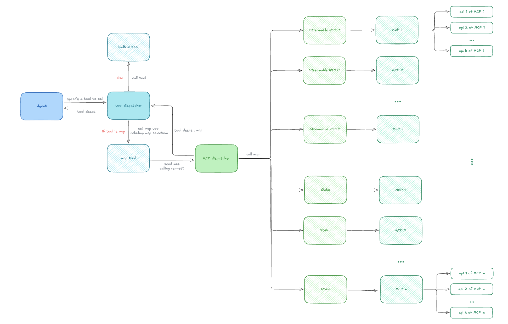

# MCP Client Architecture

## Overview

The MCP (Model Context Protocol) Client module enables the drowcoder agent to discover and invoke tools from multiple MCP servers through a hierarchical dispatch architecture.

## Architecture Diagram



The architecture follows a layered dispatch pattern:

- **Agent** → **Tool Dispatcher** → **MCP Tool** → **MCP Dispatcher** → **MCP Clients** → **MCP Servers**

The MCP Dispatcher manages multiple MCP server connections and routes tool calls to the appropriate server based on configuration. Each MCP server can expose multiple APIs through different transport protocols (Streamable HTTP or Stdio).

## Configuration Format

The MCP configuration format follows the **[Cursor MCP configuration standard](https://cursor.com/zh-Hant/docs/context/mcp)**, using the `mcpServers` structure:

### JSON Format

```json
{
    "mcpServers": {
        "server_name": {
            "url": "https://mcp-server.example.com",
            "headers": {
                "Authorization": "Bearer token"
            }
        }
    }
}
```

### YAML Format

```yaml
mcpServers:
  server_name:
    url: "https://mcp-server.example.com"
    headers:
      Authorization: "Bearer token"
```

**Transport Detection:**
- `url` field → Streamable HTTP transport (✅ implemented)
- `command` field → Stdio transport (🚧 planned)

## Core Components

- **MCPDispatcher**: Manages MCP server registry and routing
- **MCPBaseClient**: Abstract base class for transport implementations
- **MCPStreamableHTTPClient**: HTTP-based client implementation
- **MCPInstance**: Represents a registered MCP server instance

## Future Enhancements

- Stdio transport support
- Enhanced error handling and logging
- Connection pooling and health checks
- Additional MCP protocol methods (resources, prompts, etc.)

## Implementation Progress

Current implementation status according to the architecture:

```
Agent ✅
  ↓
Tool Dispatcher ❌ (Not implemented)
  ↓
MCP Tool ❌ (Not implemented)
  ↓
MCP Dispatcher ✅ (Complete)
  ↓
MCP Clients:
  - Streamable HTTP ✅ (Complete)
  - Stdio ❌ (Not implemented)
  ↓
MCP Servers ✅ (Can connect)
```

**Overall Progress: ~50-60%**

- ✅ **Foundation Layer**: MCP Dispatcher and Streamable HTTP Client are complete
- ⚠️ **Integration Layer**: Tool Dispatcher → MCP Tool integration pending
- ❌ **Stdio Protocol**: Not yet implemented
